# MS4-PROJECT-GameWork


[View the live project here](https://ms4-social-network.herokuapp.com/)

# Inspiration

I got the Inspiration from 9gag and twitter to build a social network app for gamers, like forum for gamers. For users to post funny images or maby something funny that happend ingame.


---

# Table of contents

* [UX](#ux)
* [Features](#features)
* [Screenshots](#screenshots)
* [Design](#design)
* [Technologies](#technologies)
* [DB Schema](#db)
* [Testing](#testing)
* [Deployment](#deployment)
* [Credits](#credits)
* [Contact](#contact)

---

## User Experiance (UX)

The aimed user group for the GameWork website will be gamers that wants to share thoughts and opinions of games with other gamers. 

## User stories

*  First Time Visitor Goals

    * As a First Time Visitor, I want to easily navigate through the website be able to easily access all of its features.
    * As a First Time Visitor, I want to be able to create an account easily.
    * As a First Time Visitor, I want to be able to easily find posts and other users.
    * As a First Time Visitor, I want to be able to post images and texts.

* Returning Visitor Goals
    * As a Returning Visitor, I want to be able to log in easily.
    * As a Returning Visitor, I want to easily look trough my feed for posts.
    * As a Frequent Visitor, I want a the possibility to edit or delete my posts or comments.
    * As a Frequent Visitor, I want a profile page that I can edit.
    * As a returning user, I want to be able to log out when I am done.

*  Frequent User Goals
    * As a Frequent Visitor, I want an admin that can sort out posts or profiles that needs to removed for whatever reason.
    * As a Frequent Visitor, I want to be able to see contact information for the websites creator.
    * As a Frequent Visitor, I want to be able to contribute to the growth of the website via donations.
    * As a Frequent Visitor, I want to be able to donate via a secure channel.


## Features

* Existing Features

    * Responsive on all device sizes

    * Design
        * An attractive and simple layout.
        * Simple navigation throughout the website by using the navigation bar.
        * Colors and fonts was chosen to inspire from an retro game design
    
    * General
        * A email for people to contact me.
    
    * Register, login and logout
        * User can create a new account on the web application.
        * User can login with their existing accounts.
        * User can easily log out.
        * If a user creates a new account, logs in or logs out, a flashed message will appear with the action the person has done.

    * Feature ideas to Implement
        * The user can delete their profile.
        * The user can send DMs.
        * The user can upload multiple images.
        * The user can share other users posts.
        * The user can tag other users in posts.
        * Error handling required for instances where usher visits an unavailable page

---

## Testing User Stories from UX Section

##  First Time Visitor Goals

* As a First Time Visitor, I want to easily navigate through the website be able to easily access all of its features.
    - The website has a navigation bar at the top that is based on icons to represent each section (Feed, Profile, Donation, Sign-out).
    - If you hover over each icon there is also text to clarify what the section contains. By clicking on one of these you are redirected to the chosen page.
* As a First Time Visitor, I want to be able to create an account easily.
    - If you are a new user that hasn't logged in, the first page you will be directed into is a login or reigster page.
* As a First Time Visitor, I want to be able to easily find posts and other users.
    - There is a search bar in the top that has a placeholder that says: "search for gamers". By searching for usernames here you can find and follow the searched user.
    - By clicking the "Feed" icon in the navbar or the GameWork icon you are directed to the post feed that shows all the posts of the people you follow.
* As a First Time Visitor, I want to be able to post images and texts.
    - In the feed section's top there is an input field that allows the user to create a text and inserting an image. By clicking the button bellow that says "post" the text and/or the image is posted.

## Returning Visitor Goals

* Returning Visitor Goals
    * As a Returning Visitor, I want to be able to log in easily.
        - If you are a user that hasn't logged out your previous session and opens the website, you will go directly into the feed section. Bypassing the login or register page.
    * As a Returning Visitor, I want to easily look trough my feed for posts.
        - The feed section that contains all the posts has an infinity scroll that is based on the date and time the post was created. Meaning that all the newest posts are at the top. 
    * As a Frequent Visitor, I want a the possibility to edit or delete my posts or comments.
        - On each post or comment that yourself has created, there is an edit and a delete function at the top right corner. 
    * As a Frequent Visitor, I want a profile page that I can edit.
        - Each user are assigned a profile which they can edit the profile image, date of birth, location and a small biography.
    * As a returning user, I want to be able to log out when I am done.
        - In the navbar there is an icon that says "sign-out", located at the far right. By clicking this you are redirected to a new page to confirm the logout. 

##  Frequent User Goals

*  Frequent User Goals
    * As a Frequent Visitor, I want an admin that can sort out posts or profiles that needs to removed for whatever reason.
        - Django has an Super user function that allows the creator to have full access to all posts and profiles. By using this the creator can delete or edit any posts or profiles.
    * As a Frequent Visitor, I want to be able to see contact information for the websites creator.
        - On the donations section there is contact information in the bottom of the page. 
    * As a Frequent Visitor, I want to be able to contribute to the growth of the website via donations.
        - By visiting the donations section, you are presented with three options of donation amounts. By clicking on one you are redirected to a payment page that requires you card info to complete the payment. 
    * As a Frequent Visitor, I want to be able to donate via a secure channel.
        - All donation payments are handled via Stripe. A well known payment system. This system also encrypts your payment details.

## Here is some examples of bugs that I encounterd during testing:


* There was an issue with Stripe Payments. When sending up an POST request to the stripe servers I was left with an 402 error. The error was described as a "invalid card number". By reading the stripe docs I found that the real issue was that I didn't create a token for the card details. I solved this issue by collecting the card details from the user inputs and sending a new request to the stripe servers to create a token for the card details. After that I collected the response into a new variable for the card details, which I then used to make a new correct POST request for the payment. 
    

* Heruku live website programming error. Migrations was incorrect. When I pushed to heroku and open products on the live website i got an "ProgrammingError" I didn't know what to do so I googled around. tried to delete the migrations and migrate again, but it didn't work. So I took help from tutor assistant and got the help to look at Code Institutes Boutique Ado walktrough project on the deployment section. I remade the deployment to heroku and remade the migrations and after deployment it worked.

* In live mode after pushing to heroku it didn't load any images. The problem was syntax error, the problem was solved by adding {{ MEDIA_URL }} to the hrefs.
    

---

# Technologies

## Technologies Used

Languages:
- 	HTML5
-	CSS3
-	Javascript
-	Python 

Frameworks:
- 	Django
-   Bootstrap 5
-   Jquery

Storing/editing/deploying Code:
-	Gitpod
-	Github
-   Heroku

Storage/Database:
-   Amazon Web Services (to store static/image files)
- 	Heroku Postgres (for database)

Payment Handling:
- 	Stripe (for facilitating payments)

Other:
-   Google Fonts
- 	Font Awesome

### Design

* #### Colour Scheme
    * The color i used for background is a gradient, black and blue.

* #### Typography
    * The Orbitron font is the main font used throughout the whole website.

* #### Imagery
    * Imagery is important. The large, background hero image is designed to be striking and catch the user's attention. It also has a modern, energetic aesthetic.

* #### Wireframes
    * Wireframe Landing Page - [View](media/Wireframes/LandingPageWF.png)
    * Wireframe Post list - [View](media/Wireframes/PostListPage.png)
    * Wireframe Profile page - [View](media/Wireframes/ProfilePage.png)
    * Wireframe Donation - [View](media/Wireframes/DonationPage.png)


---

## DB Schema

DB Image:

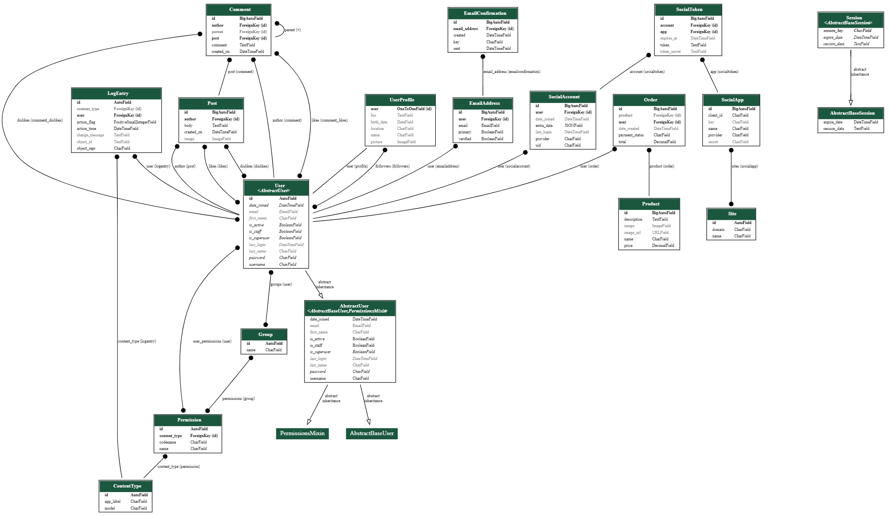

---

# Testing

**Testing section is located [here](testing.md)**

### My methods for testing my webpage consisted of:

* Chrome DevTools is used to detect problems and test responsiveness.
* W3C Markup Validation Service
    * The W3C Markup Validation Service is used to check whether there were any errors in the HTML5 code.
* W3C CSS validator
    * The W3C CSS validator is used to check whether there were any errors in the CSS3 code.
* PEP8
    * The PEP8 validator is used to check whether there were any errors in the Python code.

* In the future I plan to implement automated tests.

---

## Deployment

--- 

### Requirements
* Python3
* Github account
* AWS account
* Heroku account


_Github_

The source code for this site is in GitHub.

To clone the code from GitHub:

1.	On GitHub, navigate to the main page of the repository.
2.	Above the list of files, click Code.
3.	To clone the repository using HTTPS, click HTTPS under "Clone".
4.	Open Git Bash.
5.	Change the current working directory to the location where you want the cloned directory.
6.	Type git clone, and then paste the URL you copied earlier:
    ```$ git clone https://github.com/YOUR-USERNAME/MS4_KeepRolling.git```
7.	Press Enter to create your local clone.
8.  Create your own env.py file to store variables, and ensure this is listed in your .gitignore file to keep these from being displayed publicly.

_Deployment to Heroku_

Heroku is used to deploy the app:

1.	When logged into your account, create new app:
    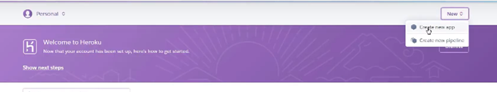

2.	Choose app name and your closest region:

	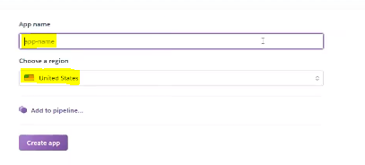 

3.	On Resources tab, provision Heroku Postgres (use the free plan):

    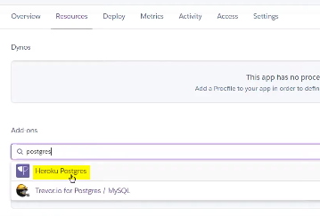 
	 
4.	Back in gitpod, install the following via these commands:
	 - ```pip3 install dj database url```
	 - ```pip3 install psycopg2 binary```

5.	Freeze the requirements so this is updated in the requirements.txt file to make sure Heroku installs all apps when deployed:
	- ```pip3 freeze > requirements.txt```

6.	To get stores database setup, go to settings.py an import dj_database_url:

    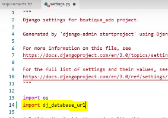 

7.	Down in the databases setting, comment out default configuration and replace the default database with a call to dj_database_url.parse, and give it the database URL from Heroku in the brackets (from your config variables in your app settings tab):

    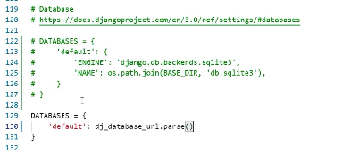 

8.	Now run all migrations again, by running:
	- ```python 3 manage.py migrate```

9.	Then create a superuser to log in with:
	- ```python3 manage.py create superuser```

10.	Back in settings.py remove the Heroku database config, and uncomment the original so our database URL doesn't end up in version control:
    
    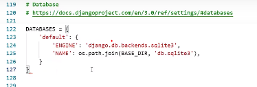 

11.	Then commit to github.

12.	Use an if statement in settings.py, so when app is running on Heroku, where database URL environment variable is defined, we connect to Postgres, otherwise we connect to sqlite:
    
    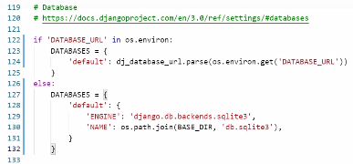 

13. Install unicorn, which will act as our webserver, then freeze that into requirements.txt:
	- ```pip3 install gunicorn```
	- ```pip3 freeze > requirements.txt```

14.	Now create Procfile, and enter the following to tell Heroku to create a web dyno, which will run unicorn and serve our django app:
	```web: gunicorn APP_NAME.wsgi:application```

15.	Temporarily disable collectstatic:
    
    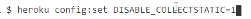 

16.	Add the hostname of our Heroku app to allowed hosts in settings.py, add localhost aswell:
	ALLOWED_HOSTS = ['YOUR-APP-NAME.herokuapp.com', 'localhost']

17.	Then add/commit changes to github.

18.	To deploy to Heroku, enter (you may need to initialize your Heroku git remote if you created your app on the website rather than the CLI):
    
    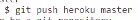 

19.	To automatically deploy on Heroku when we commit to github, on your Heroku dashboard go to Deploy > select Github, and search for your repository, then click Connect:
    
    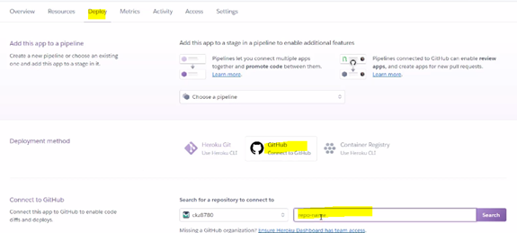 

20.	Click to enable automatic deploys:
    
    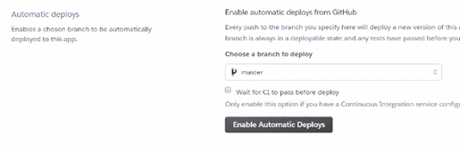 

21.	You need a new secret key to enter in you Heroku Config Vars (you can use an online Django secret key generator to do this):
    
    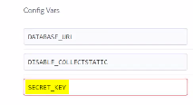 

22.	Now you can replace the secret key in settings.py with a call to get this from the environment:
    
    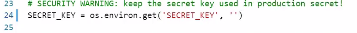 

23.	Commit/push these changes to github.

_AWS_

AWS is a cloud based storage service, used to store static files and images:

1.	After creating an AWS account (using the free version will be sufficient), access the AWS management console in your account.

2.	Find s3 by searching for this in services.

3.	Open s3 and create a new bucket.

4.	Enter a name for your bucket/select your closest region.

5.	Uncheck the block public access box, and create the bucket.

6.	Once created, click on the bucket and enter the following settings:
	-	Under Properties, turn on static website hosting
	- 	Under Permissions, paste in the CORS configuration:

	```
        [
 		    {
     		    "AllowedHeaders": [
         		    "Authorization"
     			    ],
     		    "AllowedMethods": [
       			    "GET"
     			    ],
     		    "AllowedOrigins": [
         		    "*"
     			    ],
    		    "ExposeHeaders": []
 		    }
	    ] 
    ```

    -	Go to the bucket policy tab and select, policy generator so we can create a security policy for this bucket.
    -	The policy type is going to be s3 bucket policy, allow all principals by using a star, and the action will be, get object
    -	Copy the ARN which stands for Amazon resource name from bucket policy tab and paste it into the ARN box here at the bottom, then click Add Statement, then click Generate Policy then copy this policy into the bucket policy editor.
    -	Before clicking Save, because we want to allow access to all resources in this bucket, add a slash star onto the end of the resource key
    -	Go to the access control list tab, and set the list objects permission for everyone under the Public Access section

7.	With our s3 bucket ready to go. Now we need to create a user to access it. do this through another service called Iam which stands for Identity and Access Management.

8.	Go back to the services menu and open Iam

9.	Click groups then create a new group (keep clicking through to Create Group)

10.	Create the policy used to access our bucket by clicking policies and then create policy

11.	Go to the JSON tab and then select import managed policy, then search for s3 and then import the s3 full access policy

12.	Get the bucket ARN from the bucket policy page in s3, and paste that in the JSON section

13.	Now click review policy, give it a name and a description, and then click create policy

14.	Now attach the policy to the group we created, go to groups, click manage my group, click attach policy, search for the policy we just created and select it, and click attach policy

15.	Create a user to put in the group. On the user's page, I'll click add user, create a user, give them programmatic access, then select next

16.	Now add user to your group. Important: Now download the CSV file which will contain this users access key and secret access key which we'll use to authenticate them from our Django app (cannot access this again so do this now)

17.	To Connect Django to s3 bucket, Install 2 new packages:
    -	```pip3 install boto3```
    -	```pip3 install django-storages```

18.	Then freeze requirements:
    -	```pip3 freeze > requirements.txt```

19.	Add ‘storages’ to installed apps on settings.py

20.	To connect Django to s3 we need to add some settings in settings.py to tell it which bucket it should be communicating with:
 
21.	Go to Heroku and add our AWS keys to the config variables, aswell as adding that key called USE_AWS which I'll set to true

22.	Also remove the disable collectstatic variable

23.	In our settings file, we need to tell django where our static files will be coming from in production
    
    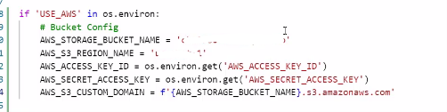 

24.	Create a file called custom storages:

    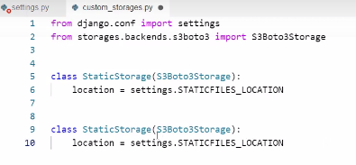 
 
25.	Go to settings.py, tell it that for static file storage we want to use our storage class we just created, and that the location it should save static files is a folder called static. Do the same thing for media files by using the default file storage and media files location settings

    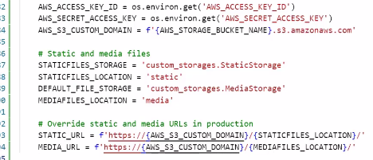 

26.	Add/commit changes in github.

---

# Credits

## Content

* I used Allauth for my website
    * [Link - Github](https://github.com/pennersr/django-allauth)
* A big thanks to Legion Script for this awesome videos on youtube that gave me inspo for my project!
    * [Link - Youtube](https://www.youtube.com/watch?v=USVjTtApVDM&list=PLPSM8rIid1a3TkwEmHyDALNuHhqiUiU5A&index=3)
* In my navbar i used this icon for "Log Out"
    * [Link - Flaticon](https://www.flaticon.com/free-icon/log-out_1329958?term=log%20out&page=1&position=14&page=1&position=14&related_id=1329958&origin=search)
* In my navbar i used this icon for "Profile"
    * [Link - Flaticon](https://www.flaticon.com/premium-icon/user_1144709)
* In my navbar i used this icon for "Home/post list page"
    * [Link - Flaticon](https://www.flaticon.com/free-icon/home_1946433)
* In my navbar i used this icon for "Donation"
    * [Link - Flaticon](https://www.flaticon.com/free-icon/coins_4994186?term=gaming&page=1&position=82&page=1&position=82&related_id=4994186&origin=search)
* For the main icon for this page i used this icon
    * [Link - Flaticon](https://www.flaticon.com/download/icon/landing/3104796?format=png&size=512)
* For my landing page i used this image
    * [Link - Pixabay](https://pixabay.com/sv/photos/utomjordisk-bakgrund-battle-star-3233076/)
* For my success page i used this image
    * [Link - Pixabay](https://pixabay.com/get/g9b4e95a35360dcf4d0ca701e678836e71605dae231dcebdd4e12ab2e454cc5f442a77cffe73d251521d41fba8f6c658d_1920.jpg?attachment=)
* In my page as background i used this site to find a nice css gradient for my page
    * [Link - Cssgradient](https://cssgradient.io/)
* For all my buttons on the site i found this button designs
    * [Link - Codepen](https://codepen.io/uiswarup/pen/RwNraeW)
* For my like and dislike buttons i used this design that i found on codepen
    * [Link - Codepen](https://codepen.io/Kallissien/pen/mwmvWd)
* To generate my DB schema i used this site
    * [Link - Dreampuf](https://dreampuf.github.io/GraphvizOnline/)


## Acknowledgements

Thanks to the following people and organizations who helped or inspired me for the project:

* My Mentor for continuous helpful feedback.
* Tutor support at Code Institute for their support.
* The lessons and knowledge of [Code Institute](https://codeinstitute.net/).
* Everything i read on stackoverflow!

### Reviewers
A special thanks goes out to those brave people who took the time to review this project. It's huge and time consuming, but it wouldn't be where it is without you.
- Nellie Östergaard - Girlfriend, works as Frontend developer
- Gustav Bodestad - Friend, works as Backend Developer

---

## Contact

E-mail: Linus.loof96@gmail.com


